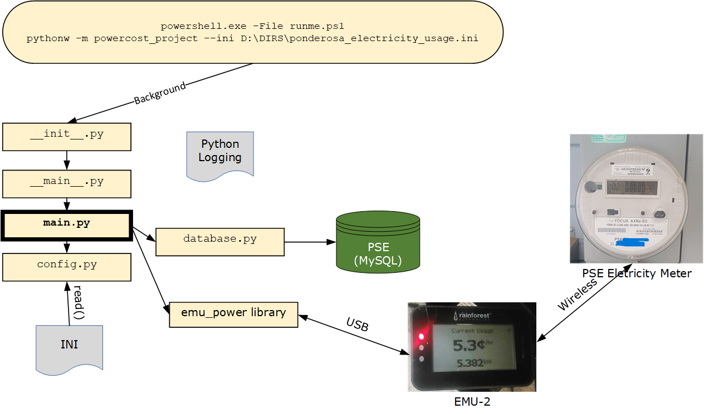

# Track My Usage of Electricity

## Motivation

Puget Sound Energy (PSE) was selling a device, **Rainforest Automation EMU-2**, to allow customers to find out how much electricity each appliance uses in an effort to reduce electricity usage.  A customer would put batteries in the unit, walk around and turn on and off various appliances to see the usage.

My intent was to track my electricity usage over time, usually on a daily basis.  PSE billing is once per month which was too late to see a spike in usage. I searched for any program that used the EMU-2 and found the Python module emu_power Version 1.51.  emu_power is based on the XML specification for the Rainforest Raven API.

The same Python script could run on Linux and Windows computers with the only difference being the I/O port name.  I initially started on a Raspberry Pi but needed a robust PC which happened to be my Windows 11 PC.

emu-power 1.51: https://pypi.org/project/emu-power/

**Device I/O**
```
Windows Port: COM5
Linux Port: /dev/ttyACM0
```


## Database

Primary MySQL Database Table pse.usage_e


**Important Data Items**

* **ID**: Type = INT; Automatically incrementing row counter for uniquness.  This value is not intended to be retrieved by later SQL.  This column is the primary key and is sole content of the Unique Index I_USAGE_E_UNIQUE.
* **UDate**: Type = DATE; Stores the date of the hourly row insertion.
* **UTime**: Type = TIME; Stores the time of the hourly row insertion.
* **kWh**: Type = DECIMAL(7,3); The kilowatt-hour reading for an hour to three decimal digit accuracy.

**DB_setup.sql**
```
create database pse

use pse;

CREATE TABLE `pse`.`usage_e` (
  `ID` INT NOT NULL AUTO_INCREMENT,
  `UDate` DATE NOT NULL,
  `UTime` TIME NOT NULL,
  `kWh` DECIMAL(7,3) NULL DEFAULT 0.0,
  PRIMARY KEY (`ID`),
  UNIQUE INDEX `I_USAGE_E_UNIQUE` (`ID` ASC) VISIBLE)
COMMENT = 'Puget Sound Energy Electricity Usage for The Ponderosa';
```

### Sample Selects

**DB_hourly.sql**

```
use pse;

select
   UDate,
   substring(UTime,1,5) as the_hour,
   kWh
from
   usage_e
order by
   ID desc;
```

**DB_daily.sql**

```
use pse;

select
   UDate as Date
   ,ELT(dayofweek(UDate),'Sunday','Monday','Tuesday','Wednesday','Thursday','Friday','Saturday') as DoW
   ,round(sum(kWh)/count(kWh),3) as kWh_Hr_avg
   ,count(kWh) as hours
   ,sum(kWh) as kWh_day_total
   ,round(((sum(kWh)/count(kWh))*24*0.105),2) as kWh_day_total_cost
   ,round((sum(kWh)/count(kWh))*24,3) as kWh_24hr_est
from
   usage_e
where
   UDate >='2022-11-05' and
   UDate <='2022-12-04'
group by
   UDate
order by
   UDate
;
```


## Program Structure




### Step 1: Command Line or Scheduled Task

Execution can be started from a Windows CMD window or from a Windows Scheduled Task.  The trigger for the Scheduled Task would be System Startup, and the intent here is that this daemon-like process would be guarenteed to run. This automatic start is not required and the command line method is easier to use.
```
powershell.exe D:\THEDIR\bin\Ponderosa_Electricity_Usage.ps1 -iniFile D:\THEDIR\Ponderosa_Electricity_Usage.ini
```
### Step 2: PowerShell Script: Ponderosa_Electricity_Usage.ps1

The only parameter to the PowerShell script -iniFile FILE or the location of the INI file.  I had to locate a way for PowerShell to read the INI file which was parsing via REGEX the INI lines.  The Python script of the next step uses the ConfigParser import to easily read in the INI data.  Now, both the PowerShell and Python scripts were reading the same INI file.

The purpose of this PowerShell script was to submit pythonw.exe to run the Python script in the background via Start-Process.  So, this PowerShell script acted like the startup of a daemon.

```
$processOptions = @{
    FilePath = $python_exec
    ArgumentList = "$python_script --ini $iniFile"
    WorkingDirectory = $rundir
    NoNewWindow = $true
    PassThru = $true
}
$process = Start-Process @processOptions
```

### Step 3: Python Script: Ponderosa_Electricity_Usage.py

Most of the process logic is in this Python script.

The values are written within an infinite loop and the script must be externally stopped (i.e., killed) if desired.  The script can be run from the command line and it will check a file to see if it is already running.  It will stop if there is another instance running.  

## Program Structure


### Functions

I soon realized that I needed to put the values into a database.  This allowed me to use my SQL skills to query the results in different ways.  The next step was to setup a MySQL database to receive the values.

    def insertDB(myDate, myHour, mykWh): A self-contained function to insert a record into the database.
       class MySignalHandler:
       def setup(self,thePID,theAR): Initialize signal handler and the variables PID and AR
       def catch(self, signalNumber, frame): Get the current time, set a message and print the message; remove file indicating the script is running; flush STDOUT and STDERR; call os.kill() to kill itself.
       def main(): Only runs code if the script is run as a top-level script.

The script has a main() function that contains the most of the code.  main() is used to ensure that the script is run as top-level script.


The EMU-2 reports the instantaneous electricity usage when queried of a value in Kilowatt Hours (kWh).  I needed a total electricity for each complete hour.  The script runs indefinitely, takes a reading every minute, and then adds up each minute value until the top of the hour.  At that point, the script divides the total of the minute readings by 60.  This value is inserted into the MySQL table pse.usage_e.


### Logic

    * if __name__ == '__main__':
      * Get command line arguments with parser
      * Read confifuration file with config
      * If script-is-executing file exists, exit
      * Redirect STDOUT and STDERR to log file
      * Get config values into script variables
      * Setup signal handler
      * Create script-is-executing file
      * Call main()
    
    * main():
      * while True:
        * If Stop-File exists, exit
        * Retry loop on call to api.get_instantaneous_demand()
        * Check if call failed and exit if it did
        * Get values: demand, divisor, multiplier, kw
        * Check if we're still in the same hour and add to kWh if so
        * else write kWh out, stop_serial() and start_serial() to refresh serial connection
        * Retry loop on start_serial()
        * Check if it's Midnight and print summary if it is.  Note that this code is obsolete since we're also inserting values into the database.
        * sleep 60 seconds


